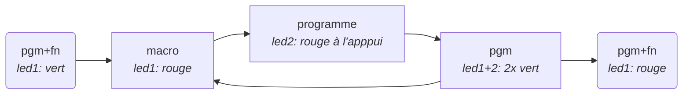
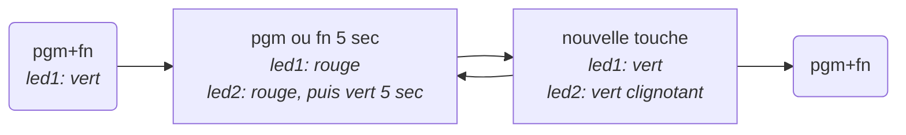

Clavier Bépo
============

## Version 1.1

La version 1.1 a introduit deux changements « inacceptables » par rapport à la version 1.0 :

  - l'inversion de l'apostrophe droite `'` et typographique `’` ;
  - le remplacement de l'espace insécable (`shift+espace`) par l'espace fine insécable, l'espace insécable étant désormais accessible avec `shift+alt+espace`.

L'application du patch suivant sur le fichier `/Library/Keyboard Layouts/bepo 1.1.bundle/Contents/Resources/bepo.keylayout` permet de rétablir la disposition de la version 1.0 pour ces caractères.

```diff
--- /Volumes/bepo 1.1 rc2/bepo 1.1.bundle/Contents/Resources/bepo.keylayout 2019-04-30 12:10:22.000000000 +0200
+++ /Library/Keyboard Layouts/bepo 1.1.bundle/Contents/Resources/bepo.keylayout 2019-08-03 15:17:13.000000000 +0200
@@ -179,7 +179,7 @@
            <key code="42" action="ç"/>
            <key code="43" action="g"/>
            <key code="44" action="f"/>
-           <key code="45" action="’"/>
+           <key code="45" action="'"/>
            <key code="46" action="q"/>
            <key code="47" action="h"/>
            <key code="48" output="&#x0009;"/>
@@ -359,7 +359,7 @@
            <key code="47" action="H"/>
            <key code="48" output="&#x0009;"/>
            <!-- Tab -->
-           <key code="49" action="fineinsecable"/>
+           <key code="49" action="insecable"/>
            <key code="50" action="Ê"/>
            <key code="51" output="&#x0008;"/>
            <!-- Backspace -->
@@ -528,7 +528,7 @@
            <key code="42" action="Ç"/>
            <key code="43" action="G"/>
            <key code="44" action="F"/>
-           <key code="45" action="’"/>
+           <key code="45" action="'"/>
            <key code="46" action="Q"/>
            <key code="47" action="H"/>
            <key code="48" output="&#x0009;"/>
@@ -707,7 +707,7 @@
            <key code="47" action="h"/>
            <key code="48" output="&#x0009;"/>
            <!-- Tab -->
-           <key code="49" action="fineinsecable"/>
+           <key code="49" action="insecable"/>
            <key code="50" action="ê"/>
            <key code="51" output="&#x0008;"/>
            <!-- Backspace -->
@@ -835,7 +835,7 @@
            <key code="2" action="trema"/>
            <key code="3" action="€"/>
            <key code="4" action="cedille"/>
-           <key code="5" action="&#x0027;"/>
+           <key code="5" action="&#x2019;"/>
            <key code="6" action="\"/>
            <key code="7" action="{"/>
            <key code="8" action="}"/>
@@ -1012,7 +1012,7 @@
            <key code="5" action="virgule"/>
            <key code="6" action="‚"/>
            <key code="7" action="‘"/>
-           <key code="8" action="’"/>
+           <key code="8" action="'"/>
            <key code="9" action="·"/>
            <key code="10" action="¶"/>
            <key code="11" action="‑"/>
@@ -1055,7 +1055,7 @@
            <key code="47" action="‡"/>
            <key code="48" output="&#x0009;"/>
            <!-- Tab -->
-           <key code="49" action="insecable"/>
+           <key code="49" action="fineinsecable"/>
            <key code="50" action="^"/>
            <key code="51" output="&#x0008;"/>
            <!-- Backspace -->
@@ -1186,7 +1186,7 @@
            <key code="5" action="virgule"/>
            <key code="6" action="‚"/>
            <key code="7" action="‘"/>
-           <key code="8" action="’"/>
+           <key code="8" action="'"/>
            <key code="9" action="·"/>
            <key code="10" action="¶"/>
            <key code="11" action="‑"/>
@@ -1229,7 +1229,7 @@
            <key code="47" action="‡"/>
            <key code="48" output="&#x0009;"/>
            <!-- Tab -->
-           <key code="49" action="insecable"/>
+           <key code="49" action="fineinsecable"/>
            <key code="50" action="^"/>
            <key code="51" output="&#x0008;"/>
            <!-- Backspace -->
@@ -1357,7 +1357,7 @@
            <key code="2" action="trema"/>
            <key code="3" action="€"/>
            <key code="4" action="cedille"/>
-           <key code="5" action="&#x0027;"/>
+           <key code="5" action="&#x2019;"/>
            <key code="6" action="\"/>
            <key code="7" action="{"/>
            <key code="8" action="}"/>
@@ -1531,7 +1531,7 @@
            <key code="2" action="trema"/>
            <key code="3" action="€"/>
            <key code="4" action="cedille"/>
-           <key code="5" action="&#x0027;"/>
+           <key code="5" action="&#x2019;"/>
            <key code="6" action="\"/>
            <key code="7" action="{"/>
            <key code="8" action="}"/>
@@ -1991,8 +1991,8 @@
            <when state="none" output="%"/>
            <when state="latin" output="‱"/>
        </action>
-       <action id="&#x0027;">
-           <when state="none" output="&#x0027;"/>
+       <action id="&#x2019;">
+           <when state="none" output="&#x2019;"/>
            <when state="latin" output="‛"/>
            <when state="scientifique" output="⊃"/>
            <when state="scientifiquebarre" output="⊅"/>
@@ -4484,8 +4484,8 @@
            <when state="none" output="‘"/>
            <when state="latin" output="ʻ"/>
        </action>
-       <action id="’">
-           <when state="none" output="’"/>
+       <action id="'">
+           <when state="none" output="'"/>
            <when state="aigu" output="́"/>
            <when state="barre" output="̸"/>
            <when state="breve" output="̆"/>
```

## Utilisation d'un clavier non Apple sur macOS

La touche en haut à gauche de la disposition (`$/#`), ne fonctionne pas avec `alt` sur les claviers non Apple (impossible d'accéder aux caractères `–/¶`). Pour corriger cela il faut remapper la touche en utilisant Karabiner-Elements et dans l'onglet « Simple modifications » ajouter deux remplacements :

 Originale                   | Remplacement
----------------------------:|:------------------
 grave_accent_and_tilde (`)  | non_us_backslash
 international1              | backslash (`\`)


### Clavier WASD

#### Positions des cavaliers

 Cavalier | Positon | Description
 --------:|---------|-------------
  1 & 2   | Off     | Défaut
  1 & 2   | On      | Mode Mac (inversion OS et alt)
  3       | Off     | scrlk LED = couche programmable
  3       | On      | scrlk LED = scrlk
  4       | Off/On  | Réinitialisation usine
  5       | Off     | fn activé
  5       | On      | fn désactivé
  6       | Off     | pgm désactivé
  6       | On      | pgm activé

#### Programmation de macros (séquence de touches)

Limitations :

  - Maximum 3 touches simultanées pour la macro
  - Maximum 32 touches pour le programme
  - Maximun 25 macros par couche



Après une programmation la led1 reste sur rouge. Pour se retrouver dans un état « normal », changer la couche de raccourci, puis revenir sur la précédente.          

#### Changer les touche Pn et Fn



#### Couleur des LED

```mermaid
graph LR
D(pgm+scrlk <br><i> led1+2: 3x vert</i>)
subgraph 
  K1[capslock<br><i>couleur actuelle</i>]
  K2[fn+Q <br> fn+G <br> fn+H <br> fn+F<br><i>led1+2 rouge puis<br>couleur actuelle</i>]
end
RVB[fn+F6 <br> fn+F7 <br> fn+F8</i>]
RVB
S[pgm <br><i> led1+2: 3x vert</i>]
F(pgm+scrlk <br><i> led1+2: 3x vert</i>)

D --> K1
D --> K2
K1 --> RVB
K2 --> RVB
RVB --> S
S --> F
```

#### Macros enregitrées

 Macro               | Effet       | Couche
--------------------:|-------------|--------
 fn + Q              | couche 1    | toutes
 fn + G              | couche 2    | toutes
 fn + H              | couche 3    | toutes
 fn + F              | couche 4    | toutes
 fn + F6             | led rouge   | programme
 fn + F7             | led verte   | programme
 fn + F8             | led bleue   | programme
 capslock            | shift_l     | 1
 shift_l + capslock  | capslock    | 1
 shift_r + capslock  | capslock    | 1
 fn + P              | *pass1*     | 2
 fn + K              | *pass2*     | 2

#### Remplacements Karabiner-Elements

 Originale      | Remplacement
---------------:|:---------------
 left_command   | left_option
 left_option    | left_command


### Clavier TypeMatrix

#### Remplacements Karabiner-Elements

 Originale      | Remplacement
---------------:|:---------------
 international4 | right_command
 application    | f16
 international5 | f17
 international3 | f18
 non_us_pound   | f19
 international2 | f20

<!--stackedit_data:
eyJoaXN0b3J5IjpbMjI3MzAyMTU1LC0zMzYyNDUxODgsLTE1Mj
YxMDM3OTcsLTE2MjgwNTE5ODQsLTk5ODYxNTU2OCwxNzcxNzQ2
OTk1LDEyNzQxOTk1OTMsLTU4NDkwMjIzOSwxNzcxNzQ2OTk1LC
0xNjY2ODgxNzQ5XX0=
-->