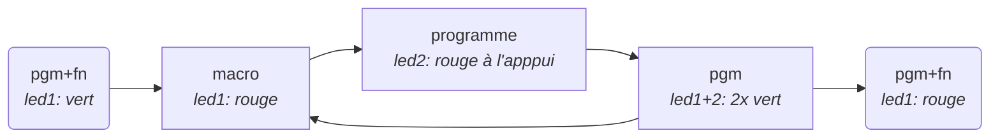
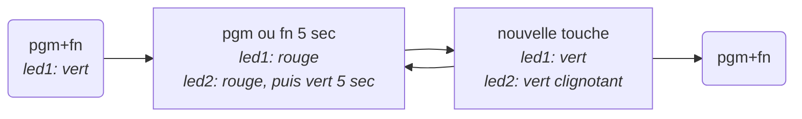

Clavier Bépo
============

## Version 1.1

La version 1.1 a introduit deux changements « inacceptables » par rapport à la version 1.0 :

  - l'inversion de l'apostrophe droite `'` et typographique `’` ;
  - le remplacement de l'espace insécable (`shift+espace`) par l'espace fine insécable, l'espace insécable étant désormais accessible avec `shift+alt+espace`.

L'application du patch suivant sur le fichier `/Library/Keyboard Layouts/bepo 1.1.bundle/Contents/Resources/bepo.keylayout` permet de rétablir la disposition de la version 1.0 pour ces caractères.

```diff
--- /Users/seth/Desktop/bepo 1.1.bundle/Contents/Resources/bepo.keylayout   2019-04-30 12:10:22.000000000 
+++ /Library/Keyboard Layouts/bepo 1.1.bundle/Contents/Resources/bepo.keylayout 2020-04-02 22:17:46.000000000 
@@ -104,25 +104,25 @@
        <keyMap index="3" baseMapSet="ISO" baseIndex="3">
            <!-- shift caps lock -->
            <key code="50" output="#"/>
        </keyMap>
        <keyMap index="4" baseMapSet="ISO" baseIndex="4">
            <!-- option -->
-           <key code="50" output=""/>
+           <key code="50" output="–"/>
        </keyMap>
        <keyMap index="5" baseMapSet="ISO" baseIndex="5">
            <!-- shift option -->
-           <key code="50" output=""/>
+           <key code="50" output="¶"/>
        </keyMap>
        <keyMap index="6" baseMapSet="ISO" baseIndex="6">
            <!-- shift option caps lock -->
-           <key code="50" output=""/>
+           <key code="50" output="¶"/>
        </keyMap>
        <keyMap index="7" baseMapSet="ISO" baseIndex="7">
            <!-- option caps lock -->
-           <key code="50" output=""/>
+           <key code="50" output="–"/>
        </keyMap>
        <keyMap index="8" baseMapSet="ISO" baseIndex="8">
            <!-- option command -->
            <key code="50" output=""/>
        </keyMap>
        <keyMap index="9" baseMapSet="ISO" baseIndex="9">
@@ -176,13 +176,13 @@
            <key code="39" action="m"/>
            <key code="40" action="s"/>
            <key code="41" action="n"/>
            <key code="42" action="ç"/>
            <key code="43" action="g"/>
            <key code="44" action="f"/>
-           <key code="45" action="’"/>
+           <key code="45" action="'"/>
            <key code="46" action="q"/>
            <key code="47" action="h"/>
            <key code="48" output="&#x0009;"/>
            <!-- Tab -->
            <key code="49" action="espace"/>
            <key code="50" action="ê"/>
@@ -356,13 +356,13 @@
            <key code="44" action="F"/>
            <key code="45" action="?"/>
            <key code="46" action="Q"/>
            <key code="47" action="H"/>
            <key code="48" output="&#x0009;"/>
            <!-- Tab -->
-           <key code="49" action="fineinsecable"/>
+           <key code="49" action="insecable"/>
            <key code="50" action="Ê"/>
            <key code="51" output="&#x0008;"/>
            <!-- Backspace -->
            <key code="52" output="&#x0003;"/>
            <!-- Enter (Fn-Return) -->
            <key code="53" output="&#x001B;"/>
@@ -525,13 +525,13 @@
            <key code="39" action="M"/>
            <key code="40" action="S"/>
            <key code="41" action="N"/>
            <key code="42" action="Ç"/>
            <key code="43" action="G"/>
            <key code="44" action="F"/>
-           <key code="45" action="’"/>
+           <key code="45" action="'"/>
            <key code="46" action="Q"/>
            <key code="47" action="H"/>
            <key code="48" output="&#x0009;"/>
            <!-- Tab -->
            <key code="49" action="espace"/>
            <key code="50" action="Ê"/>
@@ -704,13 +704,13 @@
            <key code="44" action="f"/>
            <key code="45" action="?"/>
            <key code="46" action="q"/>
            <key code="47" action="h"/>
            <key code="48" output="&#x0009;"/>
            <!-- Tab -->
-           <key code="49" action="fineinsecable"/>
+           <key code="49" action="insecable"/>
            <key code="50" action="ê"/>
            <key code="51" output="&#x0008;"/>
            <!-- Backspace -->
            <key code="52" output="&#x0003;"/>
            <!-- Enter (Fn-Return) -->
            <key code="53" output="&#x001B;"/>
@@ -832,13 +832,13 @@
            <!-- option -->
            <key code="0" action="æ"/>
            <key code="1" action="ù"/>
            <key code="2" action="trema"/>
            <key code="3" action="€"/>
            <key code="4" action="cedille"/>
-           <key code="5" action="&#x0027;"/>
+           <key code="5" action="&#x2019;"/>
            <key code="6" action="\"/>
            <key code="7" action="{"/>
            <key code="8" action="}"/>
            <key code="9" action="…"/>
            <key code="10" action="–"/>
            <key code="11" action="~"/>
@@ -1009,13 +1009,13 @@
            <key code="2" action="pointsuscrit"/>
            <key code="3" action="monnaie"/>
            <key code="4" action="©"/>
            <key code="5" action="virgule"/>
            <key code="6" action="‚"/>
            <key code="7" action="‘"/>
-           <key code="8" action="’"/>
+           <key code="8" action="'"/>
            <key code="9" action="·"/>
            <key code="10" action="¶"/>
            <key code="11" action="‑"/>
            <key code="12" action="_"/>
            <key code="13" action="♥"/>
            <key code="14" action="§"/>
@@ -1052,13 +1052,13 @@
            <key code="44" action="⛄"/>
            <key code="45" action="crochet"/>
            <key code="46" action="corne"/>
            <key code="47" action="‡"/>
            <key code="48" output="&#x0009;"/>
            <!-- Tab -->
-           <key code="49" action="insecable"/>
+           <key code="49" action="fineinsecable"/>
            <key code="50" action="^"/>
            <key code="51" output="&#x0008;"/>
            <!-- Backspace -->
            <key code="52" output="&#x0003;"/>
            <!-- Enter (Fn-Return) -->
            <key code="53" output="&#x001B;"/>
@@ -1183,13 +1183,13 @@
            <key code="2" action="pointsuscrit"/>
            <key code="3" action="monnaie"/>
            <key code="4" action="©"/>
            <key code="5" action="virgule"/>
            <key code="6" action="‚"/>
            <key code="7" action="‘"/>
-           <key code="8" action="’"/>
+           <key code="8" action="'"/>
            <key code="9" action="·"/>
            <key code="10" action="¶"/>
            <key code="11" action="‑"/>
            <key code="12" action="_"/>
            <key code="13" action="♥"/>
            <key code="14" action="§"/>
@@ -1226,13 +1226,13 @@
            <key code="44" action="⛄"/>
            <key code="45" action="crochet"/>
            <key code="46" action="corne"/>
            <key code="47" action="‡"/>
            <key code="48" output="&#x0009;"/>
            <!-- Tab -->
-           <key code="49" action="insecable"/>
+           <key code="49" action="fineinsecable"/>
            <key code="50" action="^"/>
            <key code="51" output="&#x0008;"/>
            <!-- Backspace -->
            <key code="52" output="&#x0003;"/>
            <!-- Enter (Fn-Return) -->
            <key code="53" output="&#x001B;"/>
@@ -1354,13 +1354,13 @@
            <!-- option caps lock -->
            <key code="0" action="Æ"/>
            <key code="1" action="Ù"/>
            <key code="2" action="trema"/>
            <key code="3" action="€"/>
            <key code="4" action="cedille"/>
-           <key code="5" action="&#x0027;"/>
+           <key code="5" action="&#x2019;"/>
            <key code="6" action="\"/>
            <key code="7" action="{"/>
            <key code="8" action="}"/>
            <key code="9" action="…"/>
            <key code="10" action="–"/>
            <key code="11" action="~"/>
@@ -1528,13 +1528,13 @@
            <!-- option command -->
            <key code="0" action="æ"/>
            <key code="1" action="ù"/>
            <key code="2" action="trema"/>
            <key code="3" action="€"/>
            <key code="4" action="cedille"/>
-           <key code="5" action="&#x0027;"/>
+           <key code="5" action="&#x2019;"/>
            <key code="6" action="\"/>
            <key code="7" action="{"/>
            <key code="8" action="}"/>
            <key code="9" action="…"/>
            <key code="10" action="–"/>
            <key code="11" action="~"/>
@@ -1988,14 +1988,14 @@
            <when state="scientifique" output="♀"/>
        </action>
        <action id="%">
            <when state="none" output="%"/>
            <when state="latin" output="‱"/>
        </action>
-       <action id="&#x0027;">
-           <when state="none" output="&#x0027;"/>
+       <action id="&#x2019;">
+           <when state="none" output="&#x2019;"/>
            <when state="latin" output="‛"/>
            <when state="scientifique" output="⊃"/>
            <when state="scientifiquebarre" output="⊅"/>
        </action>
        <action id="(">
            <when state="none" output="("/>
@@ -4481,14 +4481,14 @@
            <when state="scientifique" output="♆"/>
        </action>
        <action id="‘">
            <when state="none" output="‘"/>
            <when state="latin" output="ʻ"/>
        </action>
-       <action id="’">
-           <when state="none" output="’"/>
+       <action id="'">
+           <when state="none" output="'"/>
            <when state="aigu" output="́"/>
            <when state="barre" output="̸"/>
            <when state="breve" output="̆"/>
            <when state="breveinverse" output="̑"/>
            <when state="caron" output="̌"/>
            <when state="cedille" output="̧"/>

```

## Utilisation d'un clavier non Apple sur macOS

La touche en haut à gauche de la disposition (`$/#`), ne fonctionne pas avec `alt` sur les claviers non Apple (impossible d'accéder aux caractères `–/¶`). 
La correction est contenue dans le patch précédent, sinon il est possible il est possible de remapper la touche en utilisant Karabiner-Elements et dans l'onglet « Simple modifications » ajouter deux remplacements :

 Originale                   | Remplacement
----------------------------:|:------------------
 grave_accent_and_tilde (`)  | non_us_backslash
 international1              | backslash (`\`)

### Clavier Ergodox EZ Shine


#### Modes de rétroéclairage

Type            | Modes | Teinte | Luminosité
----------------|------:|----:|-----------:
Fixed           |     1 | yes | yes
Fade in/out     |     4 | yes |  no
Color wheel     |     3 |  no | yes
Rainbow slide   |     6 |  no | yes
K2000 (ext)     |     3 | yes | yes
K2000 (int)     |     3 | yes | yes
K2000 (yoyo)    |     3 | yes | yes
Red/green alt   |     1 |  no | yes
Rainbow         |    10 | yes | yes
RGB blink       |     1 |  no |  no
Left/right blink|     1 | yes | yes

### Clavier WASD

#### Positions des cavaliers

 Cavalier | Positon | Description
 --------:|---------|-------------
  1 & 2   | Off     | Défaut
  1 & 2   | On      | Mode Mac (inversion OS et alt)
  3       | Off     | scrlk LED = couche programmable
  3       | On      | scrlk LED = scrlk
  4       | Off/On  | Réinitialisation usine
  5       | Off     | fn activé
  5       | On      | fn désactivé
  6       | Off     | pgm désactivé
  6       | On      | pgm activé

#### Programmation de macros (séquence de touches)

Limitations :

  - Maximum 3 touches simultanées pour la macro
  - Maximum 32 touches pour le programme
  - Maximun 25 macros par couche



Après une programmation la led1 reste sur rouge. Pour se retrouver dans un état « normal », changer la couche de raccourci, puis revenir sur la précédente.          

#### Changer les touche Pn et Fn



#### Couleur des LED

```mermaid
graph LR
D(pgm+scrlk <br><i> led1+2: 3x vert</i>)
subgraph 
  K1[capslock<br><i>couleur actuelle</i>]
  K2[fn+Q <br> fn+G <br> fn+H <br> fn+F<br><i>led1+2 rouge puis<br>couleur actuelle</i>]
end
RVB[fn+F6 <br> fn+F7 <br> fn+F8</i>]
RVB
S[pgm <br><i> led1+2: 3x vert</i>]
F(pgm+scrlk <br><i> led1+2: 3x vert</i>)

D --> K1
D --> K2
K1 --> RVB
K2 --> RVB
RVB --> S
S --> F
```

#### Macros enregitrées

 Macro               | Effet       | Couche
--------------------:|-------------|--------
 fn + Q              | couche 1    | toutes
 fn + G              | couche 2    | toutes
 fn + H              | couche 3    | toutes
 fn + F              | couche 4    | toutes
 fn + F6             | led rouge   | programme
 fn + F7             | led verte   | programme
 fn + F8             | led bleue   | programme
 capslock            | shift_l     | 1
 shift_l + capslock  | capslock    | 1
 shift_r + capslock  | capslock    | 1
 fn + P              | *pass1*     | 2
 fn + K              | *pass2*     | 2

#### Remplacements Karabiner-Elements

 Originale      | Remplacement
---------------:|:---------------
 left_command   | left_option
 left_option    | left_command


### Clavier TypeMatrix

#### Remplacements Karabiner-Elements

 Originale      | Remplacement
---------------:|:---------------
 international4 | right_command
 application    | f16
 international5 | f17
 international3 | f18
 non_us_pound   | f19
 international2 | f20
